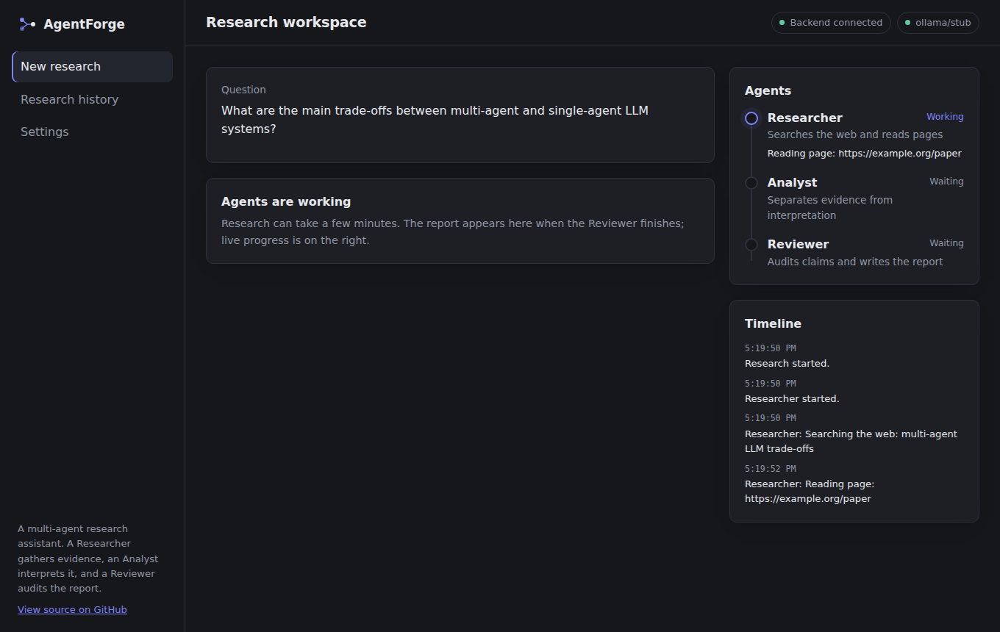
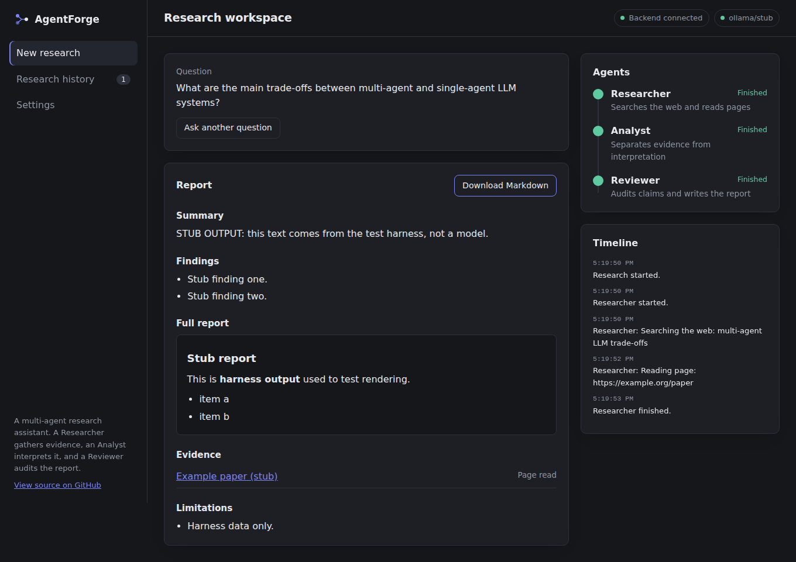
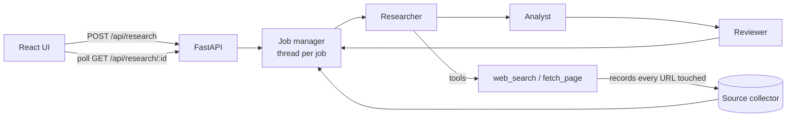

# AgentForge

[](../../actions/workflows/ci.yml)
[](https://sahajivvix-1.github.io/AgentForge/)

A multi-agent AI research assistant that **shows its sources and its failures**. You ask a question; three [CrewAI](https://github.com/crewAIInc/crewAI) agents work in sequence and return a sourced report.

**Project site:** https://info.sahaj.si/AgentForge/

| Agent | Job |
|---|---|
| **Researcher** | Searches the web and reads pages with real tools |
| **Analyst** | Separates evidence from interpretation and lists gaps |
| **Reviewer** | Audits the analysis, records failed checks, writes the final structured report |

Stack: React + Vite + TypeScript (frontend), Python + FastAPI + CrewAI (backend), GitHub Pages (project site).

> **Status:** built and tested as described under [Testing](#testing). It has **not** yet been run against a live LLM or deployed as a hosted app. See [Limitations](#limitations).

## Screenshots




*Both screenshots were captured against a stubbed backend (a test harness), so the report text is placeholder output, not model output.*

## Why it is built this way

- **Sources are never written by the model.** The `sources` list in the API response is recorded by the search and fetch tools from real network activity. Each source is labelled "page read" or "search result only".
- **Progress is real.** The timeline and agent cards are driven by events emitted from the running crew (task callbacks and tool calls). Nothing is simulated.
- **Failures are never reported as success.** Model errors, timeouts, and missing sources (when required) end the job as `failed` with a reason. The UI never substitutes sample results.
- **Async jobs.** Research takes minutes, so `POST` returns `202` with a job id and the UI polls. This avoids proxy timeouts on free hosts.
- `fetch_page` only accepts public http(s) addresses (basic SSRF guard).



## Run locally

Requirements: Python 3.10+, Node 20+, Git, and one model (see below).

**Quick path:** `scripts/setup.sh`, edit `backend/.env`, then `scripts/dev.sh` (macOS/Linux/Git Bash). On Windows use `scripts\setup.ps1` and `scripts\dev.ps1`. Manual steps:

```bash
# Backend
cd backend
python -m venv .venv && source .venv/bin/activate     # Windows: .venv\Scripts\activate
pip install -r requirements.txt -r requirements-dev.txt
cp .env.example .env        # then set AGENTFORGE_MODEL / AGENTFORGE_API_KEY
uvicorn app.main:app --reload --port 8000

# Frontend (second terminal)
cd frontend
npm install
cp .env.example .env        # VITE_API_BASE_URL=http://localhost:8000
npm run dev                 # http://localhost:5173
```

The header should read "Backend connected" next to your model name.

### Choosing a model

Model choice is configuration only. Free tiers and quotas change, so check each provider's current terms.

| Option | `AGENTFORGE_MODEL` | Notes |
|---|---|---|
| Google Gemini API | `gemini/gemini-2.0-flash` | Needs `AGENTFORGE_API_KEY` |
| Groq | `groq/llama-3.3-70b-versatile` | Needs `AGENTFORGE_API_KEY` |
| Local Ollama | `ollama/llama3.1` | No key; set `AGENTFORGE_BASE_URL=http://localhost:11434` |

Small local models can struggle with structured output. When that happens the report is shown as raw text with a visible `structured_output` failed check.

## Configuration

| Variable | Where | Purpose |
|---|---|---|
| `AGENTFORGE_MODEL` | backend | Model string (see above) |
| `AGENTFORGE_API_KEY` | backend | Provider key. **Backend only; never sent to the browser** |
| `AGENTFORGE_BASE_URL` | backend | Optional custom endpoint (Ollama, etc.) |
| `ALLOWED_ORIGINS` | backend | Comma-separated CORS origins |
| `RESEARCH_TIMEOUT_SECONDS` | backend | Per-job time limit (default 600) |
| `MAX_CONCURRENT_JOBS` | backend | Parallel jobs (default 2) |
| `VITE_API_BASE_URL` | frontend | Backend URL. Public: bundled into the JS |
| `VITE_GITHUB_URL` | frontend | Repo link shown in the sidebar |

## API

| Method | Path | Description |
|---|---|---|
| GET | `/health` | `{status, model, model_configured}`. Never returns the key |
| POST | `/api/research` | Body `{question (10-1000 chars), depth: quick\|standard\|deep, require_sources}`. Returns `202` + job. `422` on invalid input, `503` if no model is configured |
| GET | `/api/research/{id}` | Job with `status` (queued/running/succeeded/failed), `events`, `result`, `error`. `404` if unknown or expired |

Jobs are held in server memory (last 50) and are lost on restart.

## Testing

```bash
cd backend  && python -m pytest -q                      # 21 tests
cd frontend && npm run lint && npm test && npm run build
```

Measured on the first commit: 21 backend tests passing, 5 frontend unit tests passing, 0 lint warnings, production build 353 kB JS (109 kB gzipped).

End-to-end check without model credentials, using a stub runner (a **test harness**, not a product feature):

```bash
cd backend  && python -m tests.fake_server                          # terminal 1
cd frontend && npm run dev                                          # terminal 2
cd frontend && INTEGRATION_API_URL=http://localhost:8000 npm test   # real HTTP lifecycle test
```

### Manual test procedure (live model)

1. Start both servers with real credentials. The header shows "Backend connected" and your model.
2. Submit a question. Agent cards move Researcher, Analyst, Reviewer, and the timeline lists real searches and page reads.
3. Open the report. Every link under **Evidence** must resolve to a real page.
4. Download Markdown and confirm it contains the report and sources.
5. Stop the backend. The UI shows "Backend offline" and blocks submission.
6. Set a bad API key. The run must end as **failed** with an error message, not a fake report.

## Deployment

### Project site (GitHub Pages)

The static site in `site/` deploys automatically with `.github/workflows/pages.yml`. One-time setup:

1. Name the repository **AgentForge** so the site lives at `https://<username>.github.io/AgentForge/`.
2. In the repo go to **Settings, Pages, Build and deployment, Source** and choose **GitHub Actions**.
3. Push to `main` (or run the workflow manually from the Actions tab). The first run fails if step 2 was skipped; enable Pages and re-run it.

The site detects its own repository URL when served from `github.io`, so its links need no editing.

### App (not yet verified)

- **Frontend:** Vercel or Netlify. Root `frontend`, build `npm run build`, output `dist`. Set `VITE_API_BASE_URL` to the backend URL.
- **Backend:** `backend/Dockerfile` listens on `$PORT` (default 7860). Hugging Face Spaces (Docker SDK) is one option; confirm its current resource, sleep and network rules first, since the backend needs outbound internet for web search. Set `AGENTFORGE_API_KEY` as a **secret** and `ALLOWED_ORIGINS` to your frontend origin only.
- Free hosts may sleep, and in-memory jobs are lost when the instance restarts.

## Limitations

- Not yet run end to end against a live LLM, and the app is not deployed to a public host.
- Web search uses the `ddgs` package, which scrapes DuckDuckGo. It can be rate-limited or change without notice. A failed search is reported to the agent, and with `require_sources` the run fails.
- The Reviewer reduces unsupported claims but cannot guarantee factual accuracy. Check the cited sources.
- Timeouts abandon the job; the worker thread may keep running until the model call returns.
- The job store is in memory. UI history lives in the browser's localStorage.

## Attribution and license

- [CrewAI](https://github.com/crewAIInc/crewAI) is a dependency for agent orchestration; none of its code is copied.
- Author: **Sahaj Saliya** ([@SahajIVVIX-1](https://github.com/SahajIVVIX-1)).
- The API, job manager, tools, source tracking, schemas, UI, site and tests were written for this project.
- Other dependencies: FastAPI, Pydantic, httpx, ddgs, React, Vite, react-markdown, Vitest.
- No license file is included yet. Add one (for example MIT) before inviting reuse.
